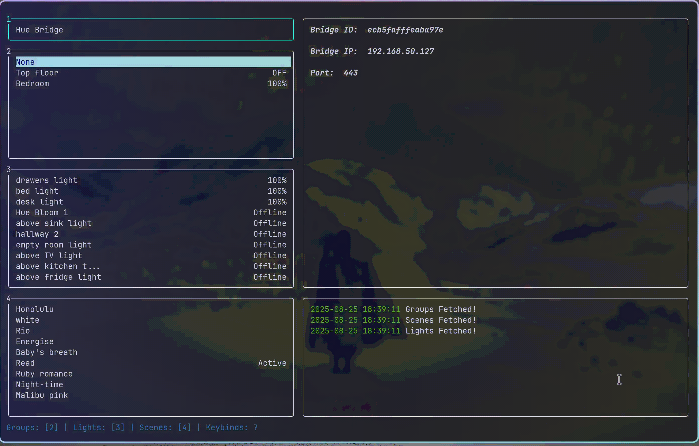

  


# Huecli 💡🖥️
A sleek terminal UI for controlling your philips hue lights via the terminal



## Table of contents 🧭
- [Installation](#installation) 
- [Usage](#usage)
- [Features](#features)
- [License](#license)

<h2 id="installation">Installation 📦</h2>
<h3>Install via Go</h3>

  ```
  go install github.com/MoAlshatti/hue-bridge-TUI/cmd/huecli@latest
```
<h3>Install via homebrew (works for mac and linux)</h3>

  ```
  brew tap MoAlshatti/homebrew-tap
  brew install --cask huecli
```

<h2 id="usage">Usage ⚙️</h2>

<h2 id="features">Features ✨</h2>

#### Filtering 🪄
 * Filtering lights and scenes based on the group 
#### server-sent events 📡
 * Syncs with changes made outside the app in real-time
#### multiple control options 🎛️
 * Allows you to control individual lights as well as group of lights
#### vim-like keybinds ⌨️
 * Supports vim keybinds as well as arrows
#### Hue API V2 support 🔗
 * Utilizes the most recent version of the hue API


<h2 id="license">License ⚖️</h2>

[MIT](https://choosealicense.com/licenses/mit/)


